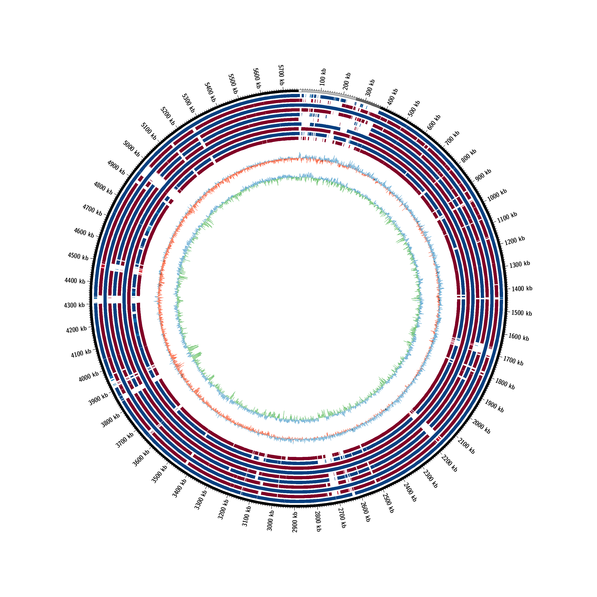
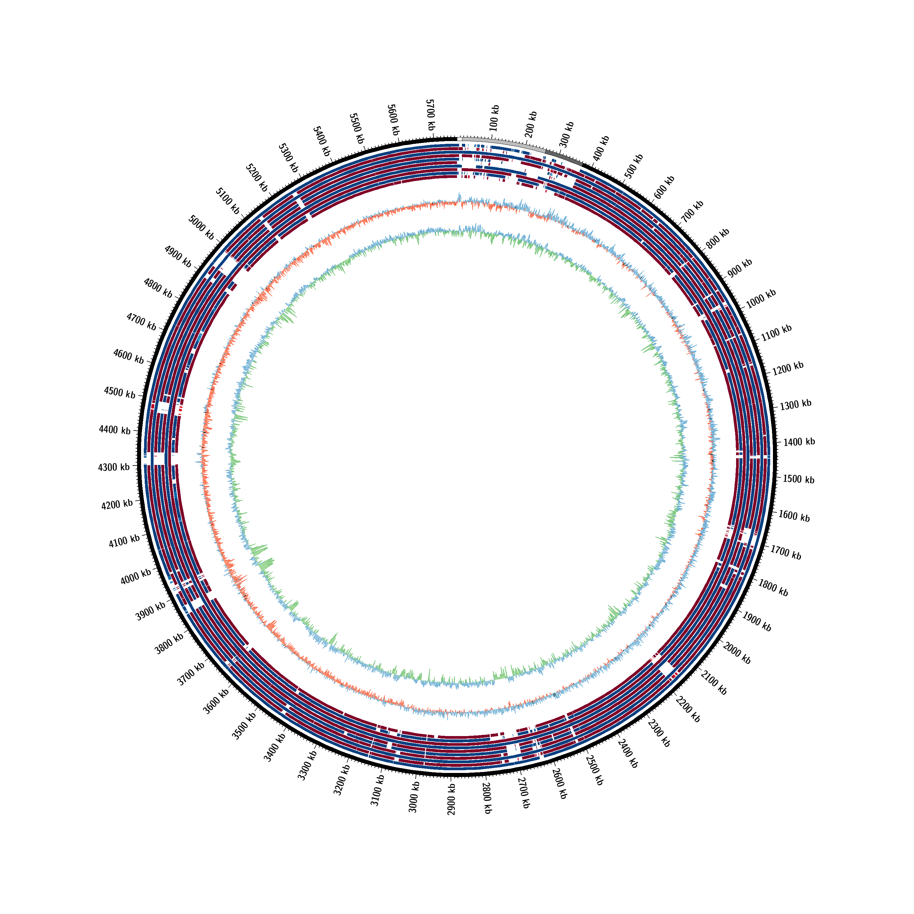
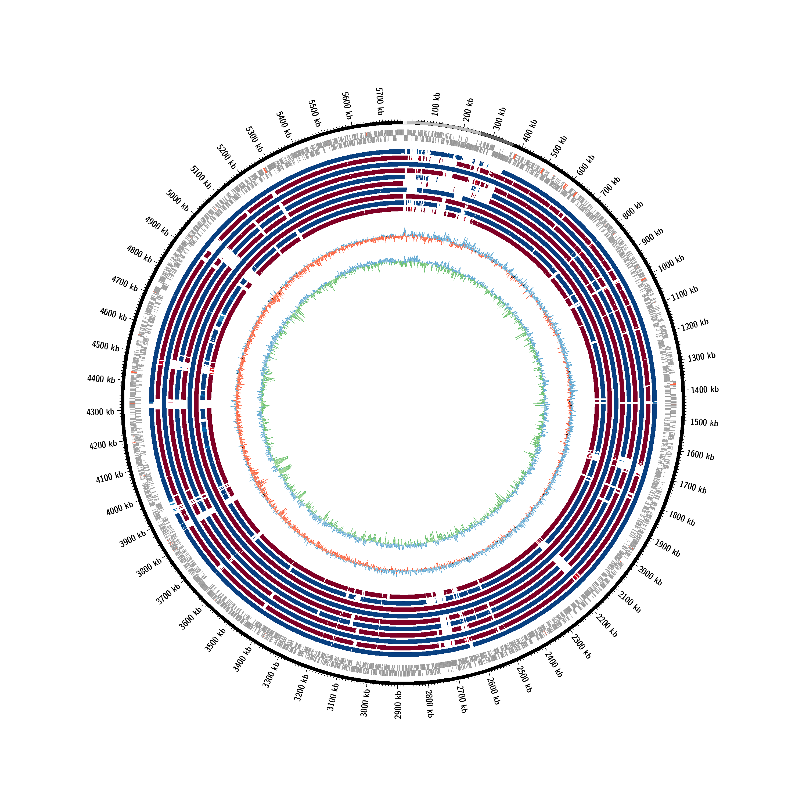
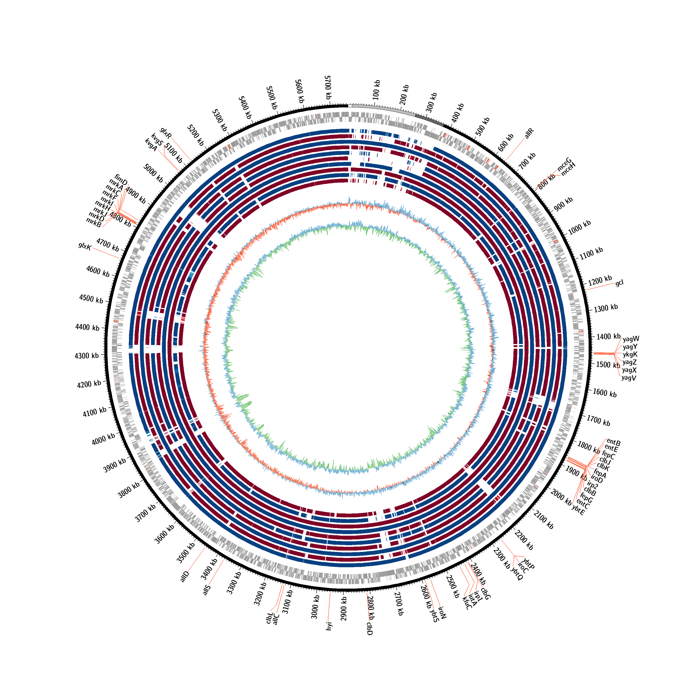
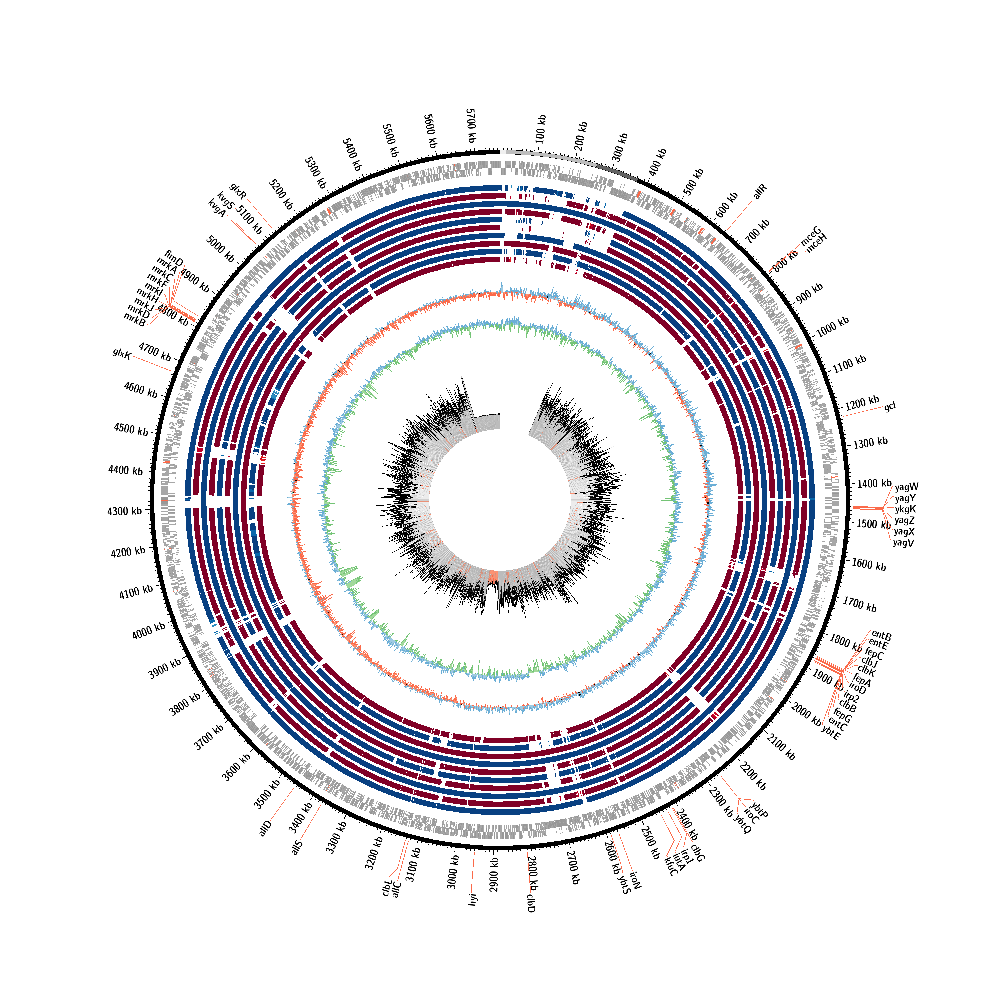
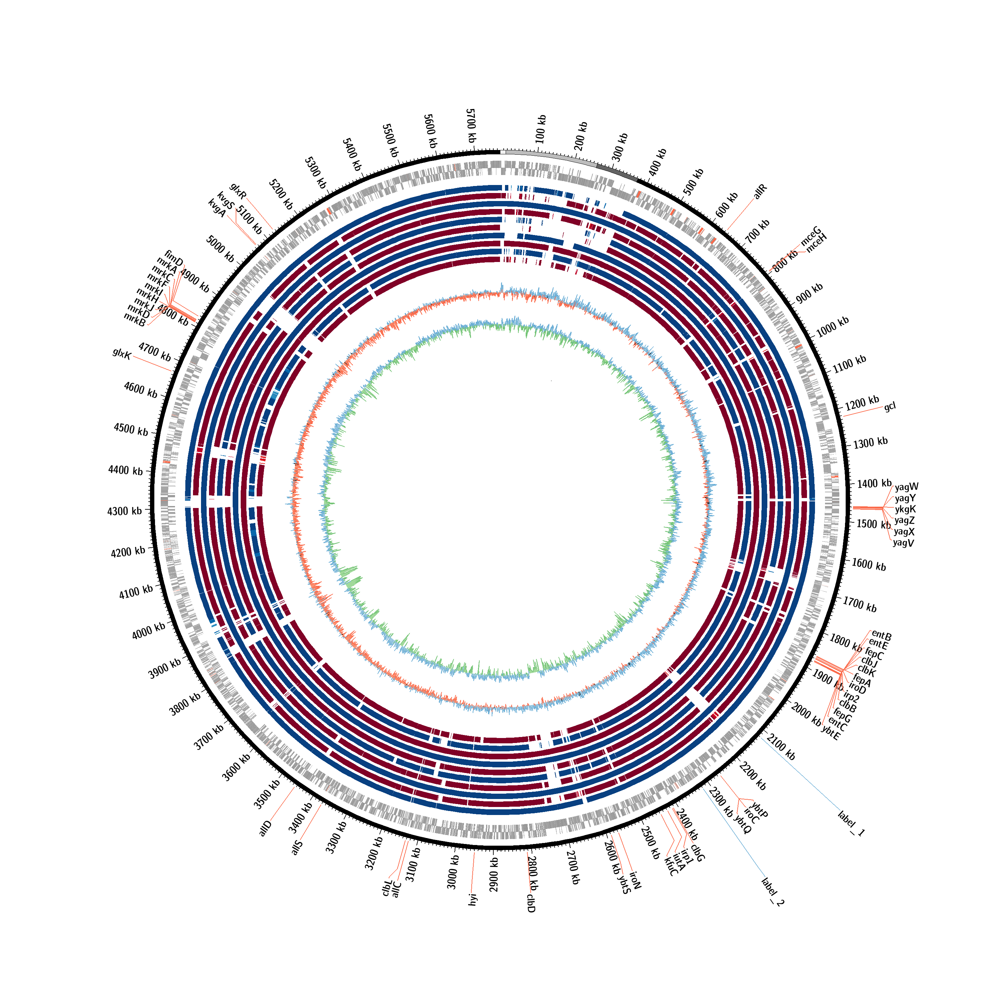
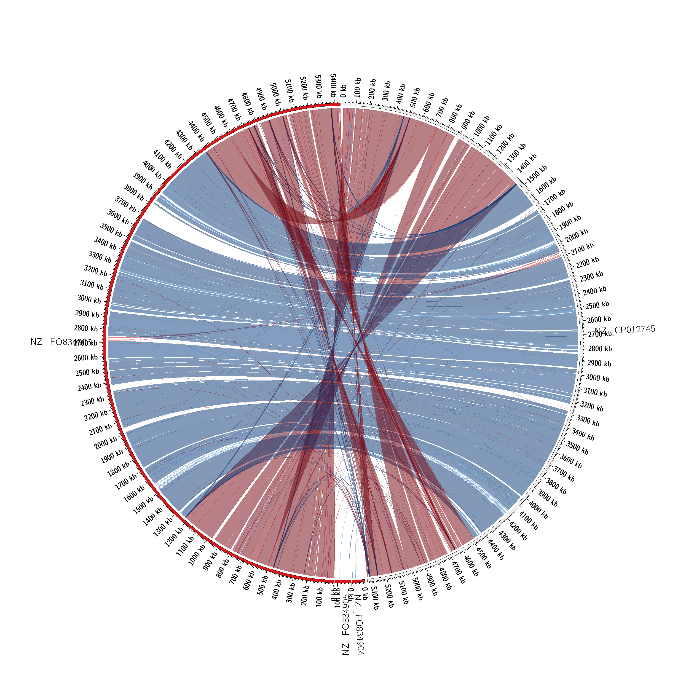

# Description

Generate circular bacterial genome plots based on BLAST or NUCMER/PROMER alignments. Generate *SVG* and *PNG* images with circos (http://circos.ca/).

# Installation

## Method 1: Installation with conda


```bash
conda install -c bioconda -c conda-forge mummer2circos
```

## Method 2: Singularity/Docker container   

A docker image is available on DockerHub: [metagenlab/mummer2circos:1.4.2](https://hub.docker.com/layers/metagenlab/mummer2circos/1.4.2/images/sha256-95144bb1e256e7902b417c89ea07679a254602fce2b3f871fc98794284e65b88?context=explore)


### build the image with singularity

- [Singularity installation](https://sylabs.io/guides/3.0/user-guide/installation.html)

```bash
singularity build mummer2circos.simg docker://metagenlab/mummer2circos:1.4.2
```

### running with singularity

```bash
singularity exec mummer2circos.simg mummer2circos -r <reference.fna> -q <query.fna>  -l
```

# Alignment method

- the whole genome alignments can be done with three different methods: megablast, nucmer or promer
- use the parameter *-a* to indicate which method to use. Nucmer is the default option.

```mummer2circos -l -a promer ...```

# Simple plot

- *-r* reference fasta
- *-q* other fasta with to compare with the reference fasta
- *-l* mendatory option to build circular plots
- genome tracks are ordered based on the order of the input query fasta files

```bash
mummer2circos -l -r genomes/NZ_CP008827.fna -q genomes/*fna
```



# Condensed tracks

```bash
mummer2circos -l -c -r genomes/NZ_CP008827.fna -q genomes/*fna
```



# With gene tracks

- the header of the reference fasta file chromosome (and eventual plasmids) should be the same as the locus accession of the genbank file. See example file *NZ_CP008828.fna*.

```LOCUS       NZ_CP008828            15096 bp    DNA              CON 16-AUG-2015```

```bash
mummer2circos -l -r genomes/NZ_CP008827.fna -q genomes/*.fna -gb GCF_000281535_merged.gbk
```



# Label specific genes

- given a fasta file of protein of interest, label the BBH of each amino acid sequence on the circular plot
- the fasta headers are used as labels (see example file VF.faa)

```bash
mummer2circos -l -r genomes/NZ_CP008827.fna -q genomes/*.fna -gb GCF_000281535_merged.gbk -b VF.faa 
```



# Show mapping depth along the chromosome (and plasmids)

- depth files can be generated from bam file using *samtools depth*
- the labels used in the .depth file should be the same as the fasta header (see example files) 
- regions with depth higher than 2 times the median are croped to that limit and coloured in green (deal with highly repeated sequences).
- regions with depth lower than half of the median depth are coloured in red.

```bash
mummer2circos -l -r genomes/NZ_CP008827.fna -q genomes/*.fna -gb GCF_000281535_merged.gbk -b VF.faa -s GCF_000281535.depth
```



# Add labels based on coordinate file

- structure: LOCUS start stop label (see labels.txt)
- labels can not include spaces

```bash
mummer2circos -l -r genomes/NZ_CP008827.fna -q genomes/NZ_FO834906.fna -gb GCF_000281535_merged.gbk -b VF.faa -s GCF_000281535.depth -lf labels.txt
```



# show links between two genomes 

```bash
mummer2circos -r genomes/NZ_CP012745.fna -q genomes/*.fna -gb GCF_000281535_merged.gbk -b VF.faa -s GCF_000281535.depth -lf labels.txt
```



# Highlight specific ranges based on coordinate file

- overlapping ranges will overlap on the figure
- TODO: add the possibility to input multiple range files that would be displayed on different tracks


